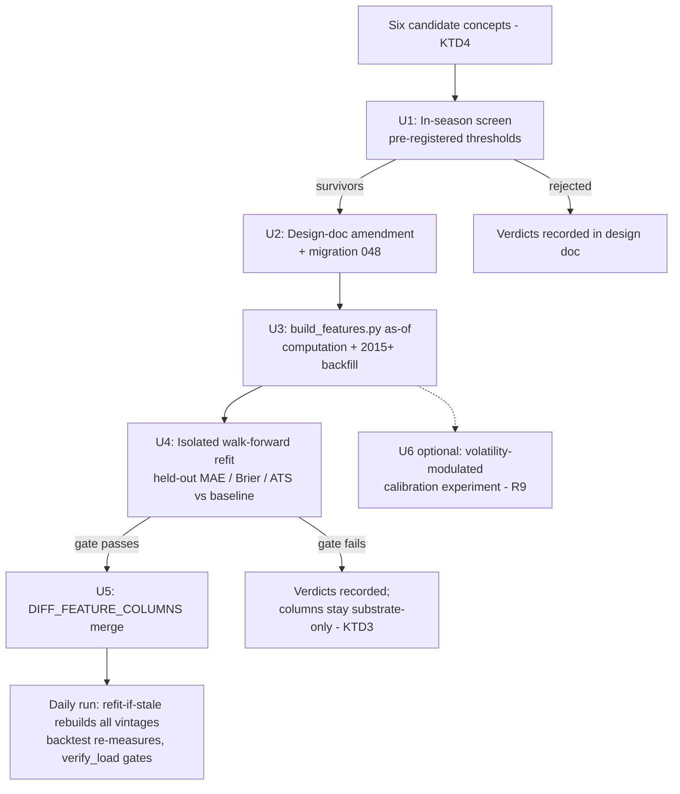

# Starter Pack Model Feature Candidates - Plan

## Goal Capsule

- **Objective:** Extract the drive-efficiency and weekly-trajectory concepts from the CFBD Starter Pack notebooks into leak-free feature candidates for the fitted prediction model, shipping only candidates that pass a walk-forward no-regression backtest.
- **Product authority:** Rob (repo owner). This plan owns only the modeling-methodology area of the packet review; the pipeline audit, AI-context upgrade, and curated-data workstreams are not active scope.
- **Execution profile:** Single-repo Python + SQL work against the live Supabase warehouse; experiments run offline, production changes flow through the daily automation.
- **Stop conditions:** Stop before U5 if no candidate passes the adoption gate (record verdicts — a null result is valid completion). Stop and surface if `core.drives` score-delta columns prove unreliable for exact drive points (KTD6 fallback decision needed).
- **Open blockers:** None.

---

## Product Contract

### Summary

Turn the two Starter Pack concepts the house model stack doesn't already have — drive efficiency (points per drive, starting field position) and weekly trajectory (recent form, volatility) — into as-of feature candidates computed from the warehouse, evaluate them with a walk-forward refit and backtest, and adopt only what strictly improves the production model. A bounded optional experiment uses volatility to modulate win-probability calibration instead of the margin.

### Problem Frame

Three purchased CFBD packets (AI API Launchpad, AI Builder Pack, Starter Pack 2026 Preseason) are sitting in Downloads. A triage pass showed most of their modeling content is below the house stack: the notebooks' SRS and basic opponent adjustments are weaker than the ridge-regression adjusted EPA already in production, and their logistic matchup predictor is weaker than the walk-forward fitted model. Without a deliberate extraction pass, the small amount of genuinely new material — drive-level efficiency and week-over-week trajectory — either goes unmined or gets rediscovered later at higher cost.

### Key Decisions

- KD1. **Offline walk-forward evaluation, not a live 2026 challenger** (session-settled: user-directed — chosen over scoring a parallel model through the season: walk-forward backtest evidence suffices and saves months of dual-model carrying cost). Governs R4.
- KD2. **Strict no-regression adoption bar** (session-settled: user-directed — chosen over a materiality threshold and case-by-case judgment: mechanical to apply and consistent with how the daily backtest already reports). Governs R5.
- KD3. **Concepts only; the packet CSVs go unused in this work** (session-settled: user-approved — the warehouse already holds the underlying data; features compute from warehouse tables). Governs R1, R2.
- KD4. **Candidate sources limited to the drive-efficiency and weekly-trajectory notebooks** (session-settled: user-approved — the remaining notebooks are superseded by stronger house implementations or belong to cfb-app analytics territory). Governs R1, R2.
- KD5. **The calibration experiment is optional and bounded** (session-settled: user-directed — approach chosen as "feature extension plus optional calibration follow-on"; it must not block the main feature work). Governs R9.

### Requirements

**Feature candidates**

- R1. Derive drive-efficiency candidates — offensive and defensive points per drive, and starting field position — from warehouse drive data at the same team-week as-of grain the existing feature substrate uses.
- R2. Derive weekly-trajectory candidates — rolling recent-form windows and a volatility (dispersion) measure of team performance — computed walk-forward from games before the prediction week only.
- R3. Every candidate is leak-free: its value for week W uses only information available before W, and early-season sparsity follows the substrate's existing fallback conventions.

**Evaluation and adoption**

- R4. Evaluate candidates by refitting the production model walk-forward with candidates included and comparing held-out backtest results against the current production baseline.
- R5. Adopt a candidate only if held-out MAE improves and neither Brier nor ATS hit rate degrades; otherwise reject it.
- R6. Record every tested candidate's verdict and metrics durably so rejected candidates are not unknowingly retried. A fully null result — no candidate passes — is a valid completion state.

**Production integration**

- R7. Adopted features enter the production substrate and daily automation as a full refit of all stored fit vintages; there is no partial-rollout path for a changed feature list.
- R8. Prediction history stays append-only and comparable across the transition: predictions from the old and new fits must be distinguishable in stored predictions.

**Optional calibration experiment**

- R9. (Optional) Test volatility-modulated win-probability calibration — volatile matchups receive flatter probabilities, stable ones sharper — under the same adoption discipline with Brier as the primary metric and no MAE or ATS degradation. Dropping R9 does not affect R1–R8.

### Key Flows

- F1. Candidate evaluation
  - **Trigger:** A candidate concept is defined from R1 or R2.
  - **Steps:** Build the candidate as an as-of substrate column; refit walk-forward with the candidate included; compare held-out backtest metrics to the production baseline; apply the R5 gate; ship via full refit or record the rejection.
  - **Outcome:** The production model only ever changes through a gated, recorded experiment.
  - **Covers:** R3, R4, R5, R6, R7.

### Acceptance Examples

- AE1. **Covers R4, R5, R7.** Given a candidate whose refit improves held-out MAE with Brier and ATS flat, when the gate is applied, then the candidate ships into the substrate and all fit vintages are refit.
- AE2. **Covers R5, R6.** Given a candidate that improves MAE but degrades ATS, when the gate is applied, then the candidate is rejected and its metrics are recorded.
- AE3. **Covers R3.** Given week 2 of a season with one prior game for a team, when trajectory candidates are computed, then values follow the substrate's existing fallback conventions rather than leaking later-season data.
- AE4. **Covers R9.** Given the calibration experiment improves held-out Brier without degrading MAE or ATS, when its gate is applied, then it ships as a calibration-layer change with the margin model untouched.

### Scope Boundaries

**Deferred for later** (separate workstreams — see How This Work Fits Together):

- dlt pipeline audit against the Builder Pack's API-efficiency guides and checklists.
- AI-context upgrade from the packs' shipped context files and OpenAPI context generator.
- Curated-data use (cross-validation of the warehouse, test fixtures).
- Team-similarity analytics (Starter Pack notebook 04) — cfb-app surface territory, not a model input.
- Automating the R5 gate into backtest tooling — `scripts/check_backtest.py` stays read-only reporting.

**No action:**

- Superseded notebook methods (simple rankings, basic opponent adjustments, SRS variants, logistic matchup predictor) — house implementations are strictly stronger.
- A live 2026 challenger model (rejected in KD1).
- The CFBD Model Training Pack — a separate product that was not purchased.

<!-- ce-section: work-relationships -->
### How This Work Fits Together

This plan owns the modeling-methodology area of the three-packet review. The breakdown below is the current understanding of the surrounding work, not a committed roadmap; later plans may revise or discard it.

- dlt pipeline audit — can proceed independently of this plan; draws on the AI Builder Pack's efficiency guides and audit checklists.
- AI-context upgrade — can proceed independently of this plan; draws on the Builder Pack context files and OpenAPI context generator.
- Curated-data use — still to decide whether it is worth doing at all; if pursued, it shares the existing flat-file loading precedent and could enable warehouse cross-validation.

### Dependencies / Assumptions

- Warehouse drive data carries starting field position and drive results sufficient for R1's candidates.
- The feature substrate is built as-of/walk-forward and currently carries 40 columns; adding candidates means a schema migration plus a backfill rebuild.
- Changing the production feature list invalidates every stored fit vintage and forces a full refit; this path has been exercised before (the list previously grew from 15 to 20 features), so R7 follows precedent rather than breaking new ground.
- Backtest tooling reports MAE, Brier, and ATS but intentionally never fails a gate itself; the R5 gate is a decision rule applied to its report.
- The existing candidate-feature screen operates at season grain (preseason inputs only) and cannot screen weekly in-season candidates as-is.
- Win-probability calibration is a per-fit scalar transform applied per game, so per-game modulation (R9) is architecturally plausible.

### Sources / Research

- CFBD Starter Pack 2026 Preseason Edition — notebooks `07_drive_efficiency.ipynb` (points per drive, field-position buckets) and `13_weekly_team_trajectory.ipynb` (rolling 4-game form, weekly PPA standard deviation), in the downloaded packet folder `artifacts-2` in the user's Downloads. The other two packets (AI API Launchpad, AI Builder Pack) were triaged; their value routes to the deferred workstreams above.
- Repo anchors for the planner: `scripts/build_features.py` (as-of substrate build), `scripts/train_model.py` (feature list and the full-refit invalidation rule), `scripts/check_backtest.py` (MAE/Brier/ATS reporting), `scripts/score_fitted.py` (calibration application), `src/schemas/api/025_game_drives.sql` (drive data surface), `src/schemas/migrations/028_features_schema.sql` (substrate schema and fit-vintage keys).

---

## Planning Contract

**Product Contract preservation:** unchanged, except the former Outstanding Questions section — all four deferred-to-planning questions are resolved by KTD1–KTD7 below and one scope line added to Scope Boundaries (gate automation deferred). No scope change.

### Key Technical Decisions

- KTD1. **A pre-registered in-season screen precedes the migration** (session-settled: user-approved — chosen over going straight to refit-and-compare: the repo's column contract requires every candidate to clear a recorded screen before shipping into `features.team_week`, and the existing screen is preseason/season-grain only). A new harness screens candidates at as-of week grain with the same pre-registered discipline as `scripts/screen_preseason_features.py` (|partial_r| >= 0.08 floor, Benjamini-Hochberg FDR 0.10, run once, verdicts recorded). Covers R6.
- KTD2. **The gate comparison runs isolated; adoption rides the self-healing refit** (session-settled: user-approved — chosen over refitting production directly: protects stored fits and prediction history during evaluation). The candidate refit fits in-memory and never writes `features.model_coefficients` / `features.model_metadata` under `fitted_v1`. Adoption = merging the `DIFF_FEATURE_COLUMNS` change; `train_model.py --refit-if-stale` detects the feature-set mismatch by set equality and rebuilds every vintage on the next daily run. `MODEL_VERSION` stays `fitted_v1`, matching the 15→20 precedent. Covers R4, R5, R7, R8.
- KTD3. **Rejected candidates' columns stay in the substrate, documented** (session-settled: user-approved — chosen over drop-on-rejection: 20 of `team_week`'s 40 columns already sit outside the model, so substrate-only columns are precedented; dropping adds migration churn). Verdicts recorded in the design-doc amendment satisfy R6.
- KTD4. **Candidate pool is six columns** (session-settled: user-approved): offensive points per drive, defensive points per drive allowed, offensive average starting field position, defensive average starting field position allowed (all season-to-date as-of), last-4-game net-rating form delta (recent minus season-to-date), and to-date weekly net-rating volatility (standard deviation). The screen prunes from this pool; the form window may vary from 4 only if the screen's pre-registration says so up front. Covers R1, R2.
- KTD5. **The R5 gate stays a human-applied decision rule over the comparison report** (session-settled: user-approved — chosen over automating into `check_backtest.py`: that script is read-only reporting by design). Covers R5.
- KTD6. **Drive points come from score-delta columns, not `drive_result` estimates.** `core.drives` carries `start_offense_score` / `end_offense_score`; their difference gives exact drive points, unlike `marts.scoring_opportunities`' TD=7/FG=3 estimates. Validate the delta against estimates during U3; fall back per the Goal Capsule stop condition if unreliable. Covers R1.
- KTD7. **Trajectory candidates compute from per-week performance aggregates under the substrate's maturity conventions.** The last-4-game form component derives from the per-week EPA aggregates the substrate build already computes (the `off_week_agg`/`def_week_agg` CTE pattern in `scripts/build_features.py`), and volatility is the dispersion of that per-week series — not the `analytics.adjusted_epa_week_build` coefficients, which are cumulative season-to-date fits and cannot yield a genuine recent-form or performance-volatility measure. Candidates apply the `MIN_TEAM_PLAYS = 150` maturity gate and are NULL early-season per the design doc's NULL-never-0 rule (the model imputes frozen train-window means). Covers R3.

### High-Level Technical Design

Three files must move together at adoption (the 042/046/047 precedent): the migration, `scripts/build_features.py` (`FEATURE_ROWS_QUERY` + `_INSERT_COLUMNS`), and `scripts/train_model.py` (`DIFF_FEATURE_COLUMNS`) — U2/U3 land the first two ahead of the gate; U5 lands the third only on gate pass.

### Assumptions

- `tune_params.py` does not need re-running: it tunes Elo/EPA hyperparameters, not the feature set; ridge alpha selection happens inside `train_model.py`.
- The full 2015+ backfill rebuild (~10,500 team-week rows) is a routine `build_features.py` run, per the 042/046/047 precedent.
- The daily workflow (`.github/workflows/daily-load.yml`) needs no changes: `--incremental` build, `--refit-if-stale`, `backtest_preseason.py`, and `verify_load.py` already sequence correctly for a feature-set change.

### Open Questions (deferred to implementation)

- R9's functional form (e.g., volatility-scaled Platt slope vs. a second calibration stage) — U6 decides after prototyping; frozen-parameter, leak-free application is the constraint.

---

## Implementation Units

### U1. In-season candidate screen

- **Goal:** Screen the six KTD4 candidates at as-of week grain with pre-registered thresholds, producing recorded verdicts.
- **Requirements:** R1, R2, R6; KTD1, KTD4.
- **Dependencies:** None.
- **Files:** `scripts/screen_week_features.py` (new), `tests/test_screen_week_features.py` (new).
- **Approach:**
  1. Build the candidate frame in-memory at (game, team, week) grain, reusing `build_features.py` helpers (`leak_free_week_index`, the adjusted-EPA week-row fetch) — no substrate writes.
  2. Compute each candidate as-of per game, then partial correlation with home margin controlling for the current model's expected margin — importing the statistical core from `scripts/screen_preseason_features.py` (partial correlation, p-value, BH-FDR, verdict rule) rather than duplicating it, so a future fix to the math applies to both screens.
  3. Apply the pre-registered decision rule (|partial_r| >= 0.08, BH-FDR 0.10) via the imported functions; emit a verdict table with partials for every candidate, rejected included.
- **Patterns to follow:** `scripts/screen_preseason_features.py` (pre-registration framing, verdict output); import its statistical functions directly, the same reuse pattern `tests/test_screen_features.py` already uses.
- **Test scenarios:**
  - Partial correlation on synthetic data matches a hand-computed value.
  - Leak boundary: a candidate value for week W built from a series including week W raises or is excluded (strict `week_index < W`).
  - BH-FDR gating: a candidate below the floor or failing FDR is marked rejected, not dropped from output.
  - Verdict table includes all six candidates with numeric partials.
- **Verification:** Screen runs against the warehouse and prints verdicts for all six candidates; verdicts are stable across re-runs on the same data.

### U2. Design-doc amendment and migration 048

- **Goal:** Amend the team-week design contract and add survivor columns to `features.team_week`.
- **Requirements:** R1, R2, R6; KTD3.
- **Dependencies:** U1.
- **Files:** `docs/brainstorms/2026-07-21-team-week-feature-design.md`, `src/schemas/migrations/048_team_week_drive_trajectory.sql` (new).
- **Approach:**
  1. Amend the design doc first (migration 028's column contract): section 1f rows, 1i NULL rules, 2a vector positions, and the stated column count; record U1's rejected candidates with their partials in the same amendment.
  2. Write migration 048 mirroring 042/046/047: idempotent `ALTER TABLE features.team_week ADD COLUMN IF NOT EXISTS` plus `COMMENT ON COLUMN` carrying the screened partial-r and NULL rule.
  3. Apply via `run_migrations.py --file` and add to the deploy manifest like 041–047 (not `MIGRATION_ORDER`).
- **Patterns to follow:** `src/schemas/migrations/042_team_week_preseason_columns.sql` (header contract language, comment shape).
- **Test scenarios:** Test expectation: none — idempotent schema-only migration; column presence is exercised by U3's build and tests.
- **Verification:** Migration applies twice without error; design-doc column count matches `features.team_week`'s actual column count.

### U3. As-of computation and 2015+ backfill

- **Goal:** Compute survivor columns leak-free in `build_features.py` and backfill all substrate seasons.
- **Requirements:** R1, R2, R3; KTD4, KTD6, KTD7.
- **Dependencies:** U2.
- **Files:** `scripts/build_features.py`, `tests/test_build_features.py`.
- **Approach:**
  1. Drive columns: add a week-bucketed drives CTE off `core.drives` joined to `core.games` for `week_index`, plus lateral joins on the spine filtered `week_index < s.week_index`, mirroring the `off_week_agg`/`def_week_agg` pattern (`scripts/build_features.py:426-447`, `:628-654`); points per KTD6 score-delta; offense and defense sides.
  2. Trajectory columns: new pure resolver over the per-week EPA performance aggregates (extend the `off_week_agg`/`def_week_agg` CTE pattern to expose the per-week series), computing the last-4-game form measure and to-date standard deviation per KTD7 — not from the cumulative `analytics.adjusted_epa_week_build` series.
  3. Append the new columns to `_INSERT_COLUMNS` before `feature_build_version`.
  4. Run the full 2015+ backfill rebuild; CI's `--incremental` path needs no changes.
- **Patterns to follow:** `resolve_adj_epa` fallback ladder (`scripts/build_features.py:165-220`); NULL-never-0 rule (design doc section 1i).
- **Test scenarios:**
  - Form delta and volatility on a synthetic week series match hand-computed values.
  - Strict leak boundary: the team's own week-W row is excluded from week-W values.
  - Maturity gate: series below `MIN_TEAM_PLAYS` yields NULL, not 0.
  - Empty series (week 1, no prior season rows in scope) yields NULL for trajectory columns.
  - Drive PPD from score deltas matches expected values on synthetic drives, including a defensive-score drive that the TD=7/FG=3 estimate would misprice.
- **Verification:** Full rebuild completes; a coverage query shows non-NULL drive columns for all seasons 2015+ where drives exist; spot-checks confirm no same-week data in as-of values.

### U4. Isolated walk-forward evaluation and gate

- **Goal:** Produce the held-out MAE/Brier/ATS comparison between the candidate feature list and the production baseline, and record the gate verdict.
- **Requirements:** R4, R5, R6; KTD2, KTD5.
- **Dependencies:** U3.
- **Files:** `scripts/train_model.py` (new no-write evaluation mode, e.g. a `--evaluate-candidates` flag); `tests/test_candidate_evaluation.py` (new).
- **Approach:**
  1. Add an evaluation mode to `train_model.py` that reuses its fitting functions in-memory with the candidate `DIFF_FEATURE_COLUMNS` list, walking forward over the same vintages as the canonical fits — a mode, not a new script, so there is no duplicate fitting harness to keep in sync (per KTD2's reuse intent).
  2. Score held-out games from as-of-game-day weekly feature vectors — not the preseason week-1 path, which leaves trajectory candidates NULL by design — and compute held-out margin MAE, Brier, and ATS per season and aggregated for `scope='fbs'`.
  3. Emit a comparison report against the production model's per-game accuracy aggregates in `marts.prediction_accuracy` (the metrics `scripts/check_backtest.py` reports: `margin_mae`, `brier`, `ats_hit_rate`); state the R5 gate verdict explicitly per candidate set.
  4. Record the verdict and metrics in the U2 design-doc amendment.
- **Execution note:** The evaluation must never write `features.model_coefficients` or `features.model_metadata` under `fitted_v1` — guard this with a test.
- **Test scenarios:**
  - Gate logic: MAE improves + Brier/ATS flat → pass; MAE improves + ATS degrades → fail; MAE flat → fail.
  - Comparison uses identical seasons and scope as the canonical baseline row.
  - No-write guard: evaluation run performs no INSERT/UPDATE on model tables.
- **Verification:** Report shows per-metric deltas and an explicit pass/fail verdict; design doc carries the recorded outcome.

### U5. Adoption integration (gate-pass only)

- **Goal:** Ship gate-passing features into the production model through the self-healing refit path.
- **Requirements:** R5, R7, R8; KTD2.
- **Dependencies:** U4.
- **Files:** `scripts/train_model.py`, `tests/test_fitted_model.py`.
- **Approach:**
  1. Add survivor `(feature_name, team_week_column)` tuples to `DIFF_FEATURE_COLUMNS`; correct the stale "18 diffs" count comment.
  2. Update the contract and staleness test suites (feature counts, index lookups, the fit-missing-new-column staleness assertion at `tests/test_fitted_model.py:368-425`).
  3. Merge; the next daily run's `--refit-if-stale` rebuilds every vintage, `backtest_preseason.py` re-measures, and `verify_load.py`'s coverage (>=90%) and backtest-freshness gates confirm the transition.
- **Patterns to follow:** the migration-042 adoption commit shape (migration + build + train landing as one deploy).
- **Test scenarios:**
  - Staleness suite: a stored fit missing a new column is detected stale and excluded from `existing`.
  - `FEATURE_NAMES` count and ordering match the updated list; `score_fitted`'s imported `TEAM_WEEK_SOURCE_COLUMNS` stays aligned.
- **Verification:** Daily run goes green end-to-end: full retrain, coverage gate, backtest freshness gate; the new canonical backtest row is consistent with U4's evaluation.

### U6. Volatility-modulated calibration experiment (optional)

- **Goal:** Test whether per-game volatility modulation of the win-probability calibration improves held-out Brier.
- **Requirements:** R9; KD5.
- **Dependencies:** U3 (volatility column), U4 (harness code to extend) — independent of U4's gate verdict, not of its existence.
- **Files:** `scripts/evaluate_volatility_calibration.py` (new); production files only on gate pass (`scripts/score_fitted.py`, `scripts/train_model.py` Platt handling).
- **Approach:** Directional guidance, not specification — extend the U4 harness: replace the scalar Platt transform with a volatility-conditioned variant (e.g., slope term `a(v) = a0 + a1 * matchup_volatility` fitted on the train window), compare held-out Brier against the scalar baseline, and require Brier improvement with MAE and ATS unaffected. Ship a production change only on a pass; otherwise record the verdict and stop.
- **Execution note:** Modulation parameters must be frozen per train vintage — no per-game fitting at scoring time.
- **Test scenarios:**
  - Reduces exactly to scalar Platt when the volatility term is zero.
  - Applied probabilities use only frozen parameters and as-of volatility (leak check).
  - Gate logic: Brier improves + MAE/ATS flat → pass; otherwise fail.
- **Verification:** Report with Brier delta and explicit verdict; recorded outcome regardless of result.

---

## Verification Contract

| Gate | Command | Applies to |
|---|---|---|
| Lint | `.venv/bin/ruff check .` | All units |
| Format | `.venv/bin/ruff format --check .` | All units |
| Tests | `.venv/bin/pytest -q` | All units |
| Migration idempotence | `python scripts/run_migrations.py --file src/schemas/migrations/048_team_week_drive_trajectory.sql` (twice) | U2 |
| Substrate rebuild | `python scripts/build_features.py` (full), then coverage query | U3 |
| Evaluation report | candidate evaluation run with explicit gate verdict | U4, U6 |
| Deploy gates | `python scripts/verify_load.py` after the first post-merge daily run | U5 |

The pre-push hook (`.githooks/pre-push`) runs ruff + pytest; all three lint/format/test gates must pass before any push.

---

## Definition of Done

- All six candidates screened with verdicts and partials recorded in the design-doc amendment (U1, U2).
- Survivor columns migrated, documented, and backfilled 2015+ with leak-free tests green (U2, U3).
- The gated evaluation report exists with an explicit per-metric verdict recorded (U4).
- On gate pass: feature list merged, contract tests updated, and the next daily run green through retrain, coverage, and backtest-freshness gates (U5). On gate fail: verdicts recorded and columns documented as substrate-only — this is valid completion.
- U6 either delivers its verdict report or is explicitly dropped without blocking R1–R8.
- Dead-end experimental code from rejected approaches is removed from the final diff.
- Feature branch pushed with lint, format, and tests green.
