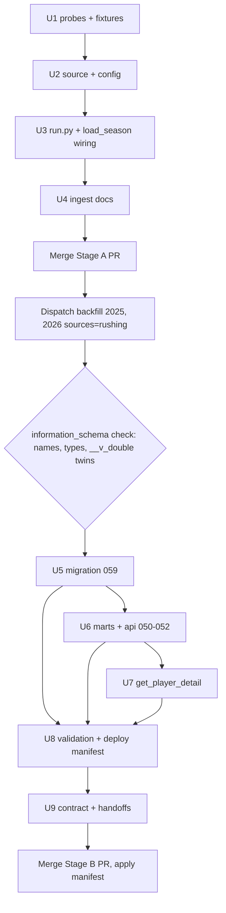

# Rushing Charting Ingest and Exposure - Plan

## Goal Capsule

- **Objective:** cfb-app and its bot can answer rushing questions by direction and yardage tier (team run game, RB production profile, run-defense scouting) from CFBD's charted rushing data, with charting coverage visible on every answer.
- **Means:** ingest CFBD's five `/rushing` endpoints as their own dlt source mirroring passing (KTD1), then publish three `api` views and a JSON block on `get_player_detail` in a second deploy stage (KTD2).
- **Product authority:** this plan owns ingest, contract semantics, the three views, and the RPC extension as one unit. Game-grain views and modeling uses are not active scope.
- **Execution profile:** two PRs in dependency order. Stage A (U1–U4) merges and runs before Stage B (U5–U9) is authored, because Stage B reads live column names.
- **Stop conditions:** a probe shows an endpoint shape that contradicts the spec facts in Sources; a settled decision proves infeasible; a live column check finds a shape the views cannot express without a schema change to `core`, `recruiting`, or `public`.
- **Tail ownership:** the implementer merges Stage A, dispatches the backfill, verifies columns, then opens Stage B. cfb-database owns the handoff to cfb-app.

---

## Product Contract

Product Contract preservation: changed: Dependencies — "two-stage inside one PR" corrected to two PRs (sequencing fact surfaced by research, no scope change); Outstanding Questions resolved in place by KTD4 and KTD6 and the section removed. Requirements R1–R18 and AE1–AE5 unchanged.

### Summary

Add CFBD's rushing charting family to the warehouse as a fifth `stats` table group with its own dlt source, and publish it to cfb-app as player-season and team-season headline views plus one tall direction-splits view, with rushing charting added to the player detail RPC.

### Problem Frame

CFBD released five rushing endpoints on 2026-09-02 that chart every rush by direction (left, middle, right) with PPA, success rate, line yards, second-level and open-field yards, stuff rate, power success, and explosiveness, at play, player-game, team-game, player-season, and team-season grain. Coverage is partial for 2025 and mostly full from 2026.

The warehouse holds none of it. Today the closest surfaces are team-season line and open-field yards from WEPA and per-play PPA from play-by-play, neither of which gives per-player, per-direction, or coverage-aware answers. cfb-app's bot can describe a passing game from charting but cannot describe a run game the same way.

### Key Decisions

- **Own the full stack in one unit, not ingest first and views on request** (session-settled: user-directed — chosen over ingest-only with a cfb-app handoff: passing's two-step delivery worked, but the consumer surfaces are already known and waiting adds a round trip). Governs R11–R16.
- **Direction splits as tall rows in one view, not wide columns on the headline views** (session-settled: user-approved — chosen over passing-style wide columns and over adding game-grain views: one grain serves team, RB, and defense readers, and wide columns would push each headline view past 60 columns). Governs R13, R14.
- **Mirror the passing unit's structure exactly where the endpoints behave the same.** Own dlt source, era guard, week walk, grants-and-indexes migration, probe fixtures, manifest rows. Divergence only where rushing differs (attribution, direction, denominators). Governs R1–R6.
- **Coverage denominators are contract, never merged or dropped.** Inherits the passing rule from `.claude/skills/cfbd-api/SKILL.md`. Governs R8, R9.
- **Player totals and team totals are different populations by upstream design.** No view may present them as reconcilable. Governs R10.

```mermaid
flowchart TB
  A[/rushing/plays] --> P[stats.rushing_plays]
  B[/rushing/players/games] --> Q[stats.rushing_player_games]
  C[/rushing/teams/games] --> R[stats.rushing_team_games]
  D[/rushing/players/season] --> S[stats.rushing_player_season]
  E[/rushing/teams/season] --> T[stats.rushing_team_season]
  S --> V1[api.rushing_charting_player_season]
  T --> V2[api.rushing_charting_team_season]
  S --> V3[api.rushing_charting_direction_season]
  T --> V3
  S --> F[public.get_player_detail]
```

### Requirements

**Ingest**

- R1. A dedicated dlt source loads all five rushing endpoints into `stats`, separate from the stats and passing sources, so one resource failing cannot discard sibling extract packages.
- R2. Data before 2025 is skipped per resource with zero API calls, via an era guard like `PASSING_DATA_START`.
- R3. The three game-grain endpoints are walked by week (regular 1–16, postseason 1–4); the two season-grain endpoints take one bare-year call each. Budget is documented in `ESTIMATED_CALLS` from the observed call count.
- R4. The source is wired into the daily load order, the immutable-once-final policy, and the backfill workflow, so the current season loads daily and finished seasons refresh only on explicit dispatch.
- R5. Grants and indexes for the five tables ship as a `--file` migration applied after the first live load, with nullable-column comments guarded the way migration 057 guards them.
- R6. Probe fixtures for all five endpoints are captured live through the probe workflow before the migration and views are authored, and unit tests load the fixtures.

**Contract semantics**

- R7. Direction values are exactly `left`, `middle`, `right`, and `unknown`; `unknown` rows are kept so direction coverage is visible.
- R8. Every exposed rate or average carries its coverage denominator alongside it: `rushing_yards_available` for yardage tiers, `direction_eligible_attempts` and `direction_available_attempts` for direction splits, `touchdown_status_available` for touchdowns.
- R9. `parse_status` is exposed on play-grain rows and its semantics (`complete`, `partial`, `invalid`) are documented as an active re-charting queue in season and partial-by-policy for 2025.
- R10. Attribution status is preserved on play rows, and every player-grain surface states that player totals exclude team-only and unresolved attempts and will not sum to team totals.

**Exposure views**

- R11. `api.rushing_charting_player_season`: one row per (season, player, team) with the headline totals, rates, yardage tiers, and denominators, plus position from the roster.
- R12. `api.rushing_charting_team_season`: one row per (season, team) with offense and defense sides flattened to `offense_*` and `defense_*` columns; `defense_*` is this team's run defense.
- R13. `api.rushing_charting_direction_season`: one row per (season, entity_type, entity_id, team, side, direction) carrying the 15 per-direction metrics, where entity_type is `player` or `team` and side is `offense` or `defense` (players are offense only).
- R14. Each view is backed by a mart registered in the refresh list, has grants for anon and authenticated, and is covered by a validation SQL file and the api-view tests.
- R15. `docs/SCHEMA_CONTRACT.md` gains the three views with column lists and NULL semantics, and a handoff doc tells cfb-app what shipped and how to read the denominators.

**Player detail**

- R16. `get_player_detail` gains an additive rushing charting block for the requested season: headline metrics and denominators plus the per-direction split as nested JSON. No existing field changes shape.

**Operations and docs**

- R17. The endpoint inventory, pipeline manifest, CLAUDE.md schema table, and the cfbd-api skill's charting-coverage section are updated to cover rushing (84 endpoints, manifest rows 76–80).
- R18. The weekly 2025 charting re-pull described in the convergence-watch handoff includes rushing alongside passing.

### Acceptance Examples

- AE1. **Covers R2, R3.** Given a backfill for 2014–2026, when the source runs, then years before 2025 log a skip with no calls and 2025–2026 issue about 62 calls per season.
- AE2. **Covers R7, R8, R13.** Given Michigan's 2025 offense, when the direction view is read, then four rows exist (left, middle, right, unknown), and a consumer can compute direction share from `direction_available_attempts` without touching raw tables.
- AE3. **Covers R10.** Given a team-season row and the sum of its players' `attempts`, when compared, then the difference equals team-only plus unresolved attempts and the contract text says so.
- AE4. **Covers R9, R18.** Given a 2025 player-season pulled in September and again a week later, when charting improved upstream, then the re-pull changed the row and the daily load did not.
- AE5. **Covers R16.** Given a player with no 2025 rushing charting, when `get_player_detail` is called, then the rushing block is NULL and every pre-existing field is unchanged.

### Scope Boundaries

- Game-grain api views (player-game, team-game) are not built. The raw tables load so they can be added when a consumer asks.
- No modeling or feature-substrate use of rushing charting. `features.team_week` and `fitted_v1` are untouched.
- No changes to the local MCP server; bot tool work lands in cfb-app per its README.
- No historical backfill attempt before 2025.
- Per-resource filtering (`--sources rushing:<resource>`) is not added; passing does not have it either. `RESOURCE_FILTERABLE` stays `stats`-only.

#### Deferred to Follow-Up Work

- Codify the dlt `__v_double` variant-twin check in `.claude/skills/schema-migrations/SKILL.md`. Today it lives only in `src/schemas/009_variant_columns.sql` and the pipeline manifest.

### Dependencies / Assumptions

- Deploy is two stages in two PRs (KTD2). Stage A merges and its backfill runs before any Stage B SQL is written, because column names (including dlt `__v_double` twins) are verified from `information_schema` on the live database, as marts 045–047 did.
- The probe workflow is the only route to live data on a fresh machine; no API key is held locally. Probes read only and never write to the warehouse.
- Assumed: the game-grain rushing endpoints reject a bare year at runtime as the passing ones did. The spec text says "requires team or week"; U1 confirms.
- Assumed: 2025 coverage is week-concentrated like passing. U1 reports it either way.
- Additional API cost is about 62 calls per season per run, within the 125,000 monthly budget.

### Sources

- Live OpenAPI spec 5.26.0 (fetched 2026-09-03): `/rushing/*` parameters, enums, and endpoint descriptions. Enums: `RushDirection` left/middle/right; `RushAttributionStatus` individual/team/multi_carrier/unmatched/ambiguous/conflict/unlinked; `RushParseStatus` complete/partial/invalid. Aggregate rows carry a `directions` object keyed unknown/right/middle/left, each with 15 metrics; team rows nest `offense`/`defense` around the same block and add `touchdownStatusAvailable`, `rushingTouchdowns`.
- CFBD announcement (Bill Radjewski, 2026-09-02): coverage partial in 2025, mostly full from 2026.
- Grounding dossier: `/tmp/compound-engineering-501/ce-brainstorm/rushing-20260903/grounding.md`.
- Passing precedent: `src/pipelines/sources/passing.py`, `src/schemas/migrations/057_passing_grants_indexes.sql`, `src/schemas/marts/045_passing_charting_player_season.sql` (variant-twin check), `src/schemas/marts/047_passing_charting_team_season.sql` (dunder flattening, team_id never-guess CTE), `docs/handoffs/2026-08-30-expansion-views-reply-to-cfb-app.md`, `docs/handoffs/2026-09-01-charting-convergence-watch.md`.
- Learnings: `docs/solutions/database-issues/security-invoker-schema-grants.md` (re-GRANT after every view recreate; test as `SET ROLE anon`), `docs/solutions/database-issues/matview-vs-regular-view-confusion.md` (verify `relkind` before adding to the refresh list), `docs/solutions/best-practices/2026-07-28-cfbd-api-usage-audit.md` (finished-season skip, 429 handling already in `api_client.py`).
- JSON-building precedent for the RPC: `src/schemas/functions/get_team_portal_activity.sql` (`jsonb_build_object` over sub-selects).

---

## Planning Contract

### Key Technical Decisions

- KTD1. **Own dlt source `cfbd_rushing`, dataset `stats`, era guard `RUSHING_DATA_START = 2025`, week walk for the three game-grain resources.** Instantiates the "mirror passing" Key Decision; `passing.py` is the template line for line, including its 400-on-bare-year handling. Governs R1–R4.
- KTD2. **Two deploy stages in two PRs** (session-settled: user-approved — chosen over one PR: Stage B SQL needs column names verified against the live database, and the probe workflow never writes to the warehouse; passing shipped the same way, commits `1ebf12d` then `7107eff`). Stage A: U1–U4. Between stages: merge, dispatch `backfill-sources` for 2025 and 2026 with `sources=rushing`, verify columns, capture the 2025 frontier baseline. Stage B: U5–U9. Governs R5, R14.
- KTD3. **Primary keys mirror passing:** plays `(game_id, play_id)`; player games `(game_id, player_id)`; team games `(game_id, team)`; player season `(season, player_id, team)` for transfer safety; team season `(season, team)`. `rusher_id` is nullable on plays and never enters a key. Governs R1.
- KTD4. **Direction melt via `LATERAL (VALUES …)` over flattened dunder columns.** dlt flattens `directions.left.carries` to `directions__left__carries` (player grain) and `offense__directions__left__carries` (team grain); no `max_table_nesting` is set, so no child table exists to join. The mart emits a fixed four-row block per (entity, side) from one `VALUES` list of four tuples, so every direction row exists even when its metrics are NULL. `unknown` is read from `directions__unknown__*`, never derived. Players contribute `entity_type = 'player', side = 'offense'`; teams contribute both sides with `entity_type = 'team'` and `entity_id = team_id`. `entity_id` is `text`: player rows carry the CFBD athlete id string as-is, team rows carry `team_id` cast to text, and the separate `team_id bigint` column stays on every row for numeric joins to `ref.teams`. Governs R7, R13.
- KTD5. **`parse_status = 'invalid'` is its own bucket.** Charted counts and coverage denominators exclude it; documentation and view comments name it separately from `partial`. Governs R9.
- KTD6. **RPC gets one `jsonb` column `rushing_charting`, built with `jsonb_build_object` from the player-season mart, NULL when no row exists.** The function is `RETURNS TABLE`, so this is a return-type change: `DROP FUNCTION IF EXISTS` then `CREATE OR REPLACE`, matching the file's existing header rule. Once non-NULL the object always carries all four direction keys. Governs R16.
- KTD7. **Variant-twin and all-NULL-column checks before any Stage B SQL.** Every bigint metric column is checked for a `__v_double` twin in `information_schema.columns`; a twin is `COALESCE`d as mart 045 does. Every nullable metric comment in the migration runs inside a guarded `DO` block because dlt omits all-NULL columns on first load. Governs R5, R14.
- KTD8. **Tests and validation stay green on an empty pre-backfill database.** Api-view tests add columns-only entries for the three views; row-count floors are added after the 2025 backfill lands. The validation SQL uses `RAISE NOTICE`, not `EXCEPTION`, for zero-row rushing views. Governs R14.
- KTD9. **Numbering:** migration `059_rushing_grants_indexes.sql`; marts and api files `050_rushing_charting_player_season.sql`, `051_rushing_charting_team_season.sql`, `052_rushing_charting_direction_season.sql`; probes 19–23; manifest rows 76–80.

### High-Level Technical Design

Stage sequencing and the gate between stages:



Direction melt, directional sketch of the mart's shape (not implementation):

```text
-- one source row per (season, player_id, team) in stats.rushing_player_season
SELECT season, 'player' AS entity_type, player_id AS entity_id, team, 'offense' AS side,
       d.direction, d.carries, d.yards, ... (15 metrics),
       direction_eligible_attempts, direction_available_attempts
FROM stats.rushing_player_season s
CROSS JOIN LATERAL (VALUES
  ('left',    s.directions__left__carries,    s.directions__left__yards,    ...),
  ('middle',  s.directions__middle__carries,  ...),
  ('right',   s.directions__right__carries,   ...),
  ('unknown', s.directions__unknown__carries, ...)
) AS d(direction, carries, yards, ...)
UNION ALL
-- team offense and team defense from stats.rushing_team_season, same VALUES shape
-- with offense__directions__* and defense__directions__* respectively
```

### Assumptions

- The five rushing endpoints honor `classification` defaulting to `fbs`; the source does not pass it, matching passing.
- The cfb-app handoff is a doc in `docs/handoffs/`; no cfb-app code changes are part of this plan.

---

## Implementation Units

### U1. Probe the rushing endpoints and commit fixtures

- **Goal:** live samples of all five endpoints, confirming the bare-year 400 behavior, 2025 coverage shape, and the flattened field names.
- **Requirements:** R6; supports R2, R3 assumptions.
- **Dependencies:** none.
- **Files:** `scripts/probe_2026_endpoints.py`; `tests/fixtures/cfbd_2026/rushing_plays.json`, `rushing_players_games.json`, `rushing_players_season.json`, `rushing_teams_games.json`, `rushing_teams_season.json`; `.github/workflows/probe-endpoints.yml` (comment only).
- **Approach:**
  1. Add probes 19–23 to `PROBES` with slugs matching the fixture names. Game-grain probes call `{year: 2025, week: 5}` and `{year: 2026, week: 1}`; season-grain probes call bare `{year: 2025}` and `{year: 2026}`. One probe issues a single bare-year call on `/rushing/plays` to record the expected 400.
  2. Run the probe workflow with `only=19,20,21,22,23`; copy `probe_output/fixtures/<slug>.json` into `tests/fixtures/cfbd_2026/` in a follow-up commit, as commit `e7e6c0e` did for passing.
  3. Record in the probe notes: 2025 row counts per week sampled, presence of `parse_status = 'invalid'`, and whether `directions.unknown` is populated.
- **Patterns to follow:** `probe_passing_players_games` and `probe_passing_players_season` in `scripts/probe_2026_endpoints.py`; `looks_capped` for round-number counts.
- **Test scenarios:** Test expectation: none — probe code is operator tooling; the fixtures it produces are consumed by U2's tests.
- **Verification:** five fixture files exist with at least one record each; probe notes state the bare-year result and 2025 coverage shape.

### U2. Rushing dlt source and endpoint config

- **Goal:** a `cfbd_rushing` source with five merge resources that loads 2025+ and skips earlier years with zero calls.
- **Requirements:** R1, R2, R3; KTD1, KTD3.
- **Dependencies:** U1.
- **Files:** `src/pipelines/sources/rushing.py` (new); `src/pipelines/config/endpoints.py` (`RUSHING_ENDPOINTS`, merged into `ALL_ENDPOINTS`); `tests/test_sources/test_rushing.py` (new); `tests/test_endpoints_config.py`.
- **Approach:**
  1. Clone `passing.py` structurally: module docstring stating why it is its own source, `RUSHING_DATA_START = 2025`, `_iter_season_weeks`, five resources with the primary keys in KTD3, `setdefault` stamping of season/week/seasonType, 400-skip-and-continue on week calls.
  2. Docstrings record the rushing-specific semantics: attribution statuses, direction eligibility, `invalid` parse status (KTD5), player-vs-team non-reconciliation (R10).
  3. `RUSHING_ENDPOINTS` mirrors `PASSING_ENDPOINTS` with schema `stats` and merge disposition; add `"rushing": RUSHING_ENDPOINTS` to `ALL_ENDPOINTS`.
- **Patterns to follow:** `src/pipelines/sources/passing.py`; `PASSING_ENDPOINTS` block in `endpoints.py`; `tests/test_sources/test_passing.py`.
- **Test scenarios:**
  - Source with `years=[2025]` exposes exactly the five resource names.
  - Each resource's table, primary key, and write disposition match KTD3 (parametrized).
  - Covers AE1. `years=[2014, 2025]`: 2014 yields no rows and makes no HTTP calls; 2025 issues 20 week calls per game-grain resource and 1 call per season-grain resource.
  - A 400 on one week logs a warning and continues to the next week; a 500 propagates.
  - Fixture rows flow through unchanged, with `season`, `week`, `seasonType` present on every game-grain row.
  - A play row with `rusher_id` NULL and `is_team_rush` true is yielded (not dropped).
  - `RUSHING_ENDPOINTS` keys match the resource names; every entry uses merge; `ALL_ENDPOINTS["rushing"]` is present (extend `test_non_reference_uses_merge`).
- **Verification:** `pytest tests/test_sources/test_rushing.py tests/test_endpoints_config.py` passes; ruff clean.

### U3. Wire rushing into the pipeline runner and season load

- **Goal:** `rushing` runs daily for the current season, is skipped for finished seasons on the unattended path, and is dispatchable through the backfill workflow.
- **Requirements:** R3, R4; KTD1.
- **Dependencies:** U2.
- **Files:** `src/pipelines/run.py`; `scripts/load_season.py`; `tests/test_load_season.py`.
- **Approach:**
  1. `run.py`: import `rushing_source`, add `run_rushing_pipeline(years, mode)` with `pipeline_name="cfbd_rushing"`, `dataset_name="stats"`; add `"rushing"` to the `--source` choices and dispatch dict.
  2. `load_season.py`: `SOURCE_ORDER` entry after `"passing"`; `ESTIMATED_CALLS["rushing"] = 62` with a comment deriving it; add to `IMMUTABLE_ONCE_FINAL` with the same re-charting caveat as passing; season-runner map entry. Do not add to `RESOURCE_FILTERABLE` or `PRESEASON_INPUT_SOURCES`.
  3. No workflow file changes: `backfill-sources.yml` validates `sources` against `SOURCE_ORDER` at runtime and `daily-load.yml` walks `SOURCE_ORDER`.
- **Patterns to follow:** `run_passing_pipeline` in `run.py`; `TestPassingWiring` in `tests/test_load_season.py`.
- **Test scenarios:**
  - `"rushing"` is in `SOURCE_ORDER` and runs after `"passing"`.
  - `ESTIMATED_CALLS["rushing"] == 62`.
  - `"rushing"` is in `IMMUTABLE_ONCE_FINAL` and not in `PRESEASON_INPUT_SOURCES` or `RESOURCE_FILTERABLE`.
  - Covers AE4 (skip half). A finished-season dry run without `--season` lists rushing as skipped; an explicit `--season 2025 --sources rushing` dry run includes it.
  - `--source rushing` is an accepted CLI choice in `run.py`.
- **Verification:** `pytest tests/test_load_season.py` passes; a `load_season.py --season 2025 --sources rushing --dry-run` prints the rushing runner and its call estimate.

### U4. Ingest documentation

- **Goal:** the endpoint inventory, manifest, project instructions, and API skill describe rushing before Stage A merges.
- **Requirements:** R9, R10, R17.
- **Dependencies:** U2, U3.
- **Files:** `docs/cfbd-api-endpoints.md`; `docs/pipeline-manifest.md`; `CLAUDE.md`; `.claude/skills/cfbd-api/SKILL.md`.
- **Approach:**
  1. `cfbd-api-endpoints.md`: bump the total line to 84 endpoints across 20 categories; add `### RushingApi (5 endpoints)` before `### PlayersApi`.
  2. `pipeline-manifest.md`: add `### Rushing (spec v5.26.0, 2026-09-03)` with a prose paragraph and rows 76–80 in the passing table shape; set status to `WORKING (backfill pending)`; correct passing rows 71–75 from "not yet backfilled" to reflect the 2025 backfill.
  3. `CLAUDE.md`: add the five tables to the `stats` line and mention rushing beside passing in the source list; bump the source module count.
  4. `SKILL.md`: add `## Rushing charting coverage` after the passing section covering the four denominators (R8), `invalid` as its own bucket (KTD5), player-vs-team non-reconciliation (R10), and the finished-season re-pull rule.
- **Patterns to follow:** the passing sections of each file, cited in Sources.
- **Test scenarios:** Test expectation: none — documentation only.
- **Verification:** the manifest table renders with rows 76–80; the endpoint doc's total matches the live spec path count.

### U5. Grants and indexes migration

- **Goal:** anon and authenticated can read the five tables, hot join columns are indexed, and nullable metric columns carry comments without failing on a table missing an all-NULL column.
- **Requirements:** R5, R8, R9, R10; KTD7.
- **Dependencies:** Stage A merged and backfilled; live column check done.
- **Files:** `src/schemas/migrations/059_rushing_grants_indexes.sql` (new).
- **Approach:**
  1. Header states the apply-after-first-load precondition, the `--file` route, and that column names were read from `information_schema` on the stated date.
  2. `GRANT SELECT` on the five tables to anon, authenticated.
  3. Indexes: `rushing_plays (game_id)`, `rushing_plays (rusher_id)`, `rushing_plays (offense_id, season)`, `rushing_player_games (player_id)`, `rushing_player_season (player_id, season)`, `rushing_team_games (game_id)`.
  4. Unguarded comments on always-present columns (`parse_status`, `attribution_status`, `direction_analysis_eligible`, the four denominators). Guarded `DO` block for every nullable metric and every `directions__*` column, generated from the verified column list rather than hand-typed.
- **Patterns to follow:** `src/schemas/migrations/057_passing_grants_indexes.sql`.
- **Test scenarios:** Test expectation: none — idempotent DDL; U8's validation SQL asserts grants survive.
- **Verification:** `python scripts/run_migrations.py --file src/schemas/migrations/059_rushing_grants_indexes.sql` applies twice without error; `SET ROLE anon; SELECT 1 FROM stats.rushing_plays LIMIT 1` succeeds.

### U6. Marts and api views

- **Goal:** three materialized views and three passthrough api views exposing player-season, team-season, and tall direction splits with contract-grade comments.
- **Requirements:** R7, R8, R10, R11, R12, R13, R14; KTD4, KTD7, KTD8.
- **Dependencies:** U5.
- **Files:** `src/schemas/marts/050_rushing_charting_player_season.sql`, `051_rushing_charting_team_season.sql`, `052_rushing_charting_direction_season.sql` (new); `src/schemas/api/050_rushing_charting_player_season.sql`, `051_rushing_charting_team_season.sql`, `052_rushing_charting_direction_season.sql` (new); `scripts/refresh_marts.py`; `tests/test_marts.py`; `tests/test_api_views.py`.
- **Approach:**
  1. Mart 050: passthrough of `stats.rushing_player_season` with `position` from `core.roster`, dunder columns renamed to single underscore, `COALESCE` for any `__v_double` twin found (KTD7). Unique index `(season, player_id, team)`.
  2. Mart 051: flatten `offense__*`/`defense__*` scalars to `offense_*`/`defense_*` excluding the `directions` block; `team_id` via the never-guess CTE from `stats.rushing_plays` `(season, offense) -> offense_id`. Unique index `(season, team)`.
  3. Mart 052: the KTD4 melt; columns `season, entity_type, entity_id (text), team, team_id (bigint), side, direction, <15 metrics>, direction_eligible_attempts, direction_available_attempts`. Unique index on `(season, entity_type, entity_id, team, side, direction)`. Header states the fixed four-row guarantee and that shares are the consumer's to compute from the denominators.
  4. Api views: `SELECT *` passthroughs with `DROP VIEW IF EXISTS`, `COMMENT ON VIEW` carrying NULL and denominator semantics plus the R10 non-reconciliation statement, and `GRANT SELECT` to anon, authenticated.
  5. `refresh_marts.py`: add the three marts to the no-dependency layer with a dated comment; confirm `relkind = 'm'` before adding.
  6. `tests/test_marts.py`: add the three marts to the `EMPTY_OK` set (the `coach_tenures` precedent) so the has-rows test passes pre-backfill; U9 removes them once the backfill lands.
- **Patterns to follow:** marts and api 045–047; `MARTS_VIEWS` comment style; `tests/test_api_views.py` `*_COLUMNS` constants and `TestViewColumns` parametrization.
- **Test scenarios:**
  - Each of the three marts exists as a materialized view (extend `tests/test_marts.py` alphabetically).
  - Covers AE2. Direction view for a known 2025 team offense returns exactly four rows with directions left, middle, right, unknown.
  - Direction view: a player-season row melts to exactly four rows, all `side = 'offense'`, `entity_type = 'player'`.
  - Direction view: a team-season row melts to eight rows, four per side.
  - Each api view exposes the expected column set (columns-only entries per KTD8).
  - Covers AE3. For one team-season, `offense_attempts` minus the summed player `attempts` is non-negative and equals `offense_team_rushes + offense_unattributed_attempts + offense_multi_carrier_attempts` within the documented tolerance, or the test documents why not.
  - Player-season view exposes `rushing_yards_available`, `direction_eligible_attempts`, `direction_available_attempts` alongside every rate column.
  - Grants: `SET ROLE anon` can select from each api view.
- **Verification:** `python scripts/refresh_marts.py` refreshes all three; `pytest tests/test_marts.py tests/test_api_views.py` passes against the live database.

### U7. Rushing charting block on `get_player_detail`

- **Goal:** the bot's player page carries rushing charting for the requested season without changing any existing field.
- **Requirements:** R16; KTD6.
- **Dependencies:** U6.
- **Files:** `src/schemas/functions/get_player_detail.sql`; `tests/test_api_views.py` (new `TestGetPlayerDetail` class).
- **Approach:**
  1. Add `rushing_charting jsonb` as the last column of `RETURNS TABLE`; `DROP FUNCTION IF EXISTS public.get_player_detail(text, integer)` precedes the create, per the file's header rule.
  2. `LEFT JOIN marts.rushing_charting_player_season` on player, season, and team, matching the mart's `(season, player_id, team)` grain from KTD3 so a mid-season transfer never yields two rushing rows for one player row; build the object with `jsonb_build_object` holding headline metrics, the four denominators, and a nested `directions` object with keys left, middle, right, unknown, each a 15-metric object. NULL when the join finds no row.
  3. Re-GRANT execute to anon, authenticated after recreate.
- **Patterns to follow:** the wepa joins in `get_player_detail.sql`; `jsonb_build_object` shape in `get_team_portal_activity.sql`.
- **Execution note:** write the failing RPC test first; this function has no tests today.
- **Test scenarios:**
  - Covers AE5. A player with no 2025 rushing charting returns `rushing_charting IS NULL` and the same pre-existing columns as before the change (compare column list to a frozen constant).
  - A charted 2025 rusher returns a non-NULL object with all four direction keys present.
  - A charted rusher whose `unknown` direction has zero carries still has the `unknown` key.
  - Calling with a season the player did not play returns one row with NULL block (existing behavior preserved).
  - A player with two 2025 team stints returns exactly one row per team stint, each carrying that team's rushing block, never a duplicated or cross-team block.
  - `SET ROLE anon` can execute the function.
- **Verification:** `python scripts/run_migrations.py --file src/schemas/functions/get_player_detail.sql` applies; the new test class passes.

### U8. Validation SQL and deploy manifest

- **Goal:** one re-runnable health check for the Stage B unit and one ordered manifest that applies marts, api views, the RPC, and validation.
- **Requirements:** R14; KTD2, KTD8.
- **Dependencies:** U5, U6, U7.
- **Files:** `src/schemas/api/validation_rushing_views.sql` (new); `deploys/rushing_views-manifest.json` (new).
- **Approach:**
  1. Validation `DO` block: existence of the three api views and the function; `RAISE NOTICE` on zero rows (pre-backfill safe); direction view has exactly four distinct directions and no (entity, side) with fewer than four rows; every rate column has its denominator column present; grants tripwire over anon and authenticated for the three views.
  2. Manifest: `{"action": "apply", "files": [marts 050–052, api 050–052, get_player_detail.sql, validation]}`. Migration 059 is applied standalone before this manifest, as 057 was, and is not listed.
- **Patterns to follow:** `src/schemas/api/validation_expansion_views.sql`; `deploys/expansion_views-manifest.json`; `scripts/deploy_schema.py run_apply`.
- **Test scenarios:** Test expectation: none — the validation file is itself the assertion set; U6 and U7 carry the pytest coverage.
- **Verification:** `python scripts/deploy_schema.py` with the manifest applies in order on a database where 059 is already applied; re-running is idempotent.

### U9. Contract, handoff, and convergence watch

- **Goal:** cfb-app knows what shipped and how to read it, and the 2025 rushing re-pull has a baseline and cadence.
- **Requirements:** R9, R10, R15, R18.
- **Dependencies:** U8; the 2025 backfill's first read.
- **Files:** `docs/SCHEMA_CONTRACT.md`; `docs/handoffs/2026-09-XX-rushing-charting-for-cfb-app.md` (new, dated at write); `docs/handoffs/2026-09-01-charting-convergence-watch.md`; `docs/pipeline-manifest.md` (status flip to `WORKING`).
- **Approach:**
  1. `SCHEMA_CONTRACT.md`: changelog entry; three api rows with full column lists, NULL semantics, denominator rule, and the R10 statement; three marts rows; five tables on the `stats` line; `get_player_detail` row notes the additive `rushing_charting` column.
  2. Handoff doc: what shipped, the denominators to carry, `invalid` vs `partial`, non-reconciliation, the two-day provisional window, and a per-season invalidation tuple `(plays, partial_count, invalid_count, direction_available_sum)` from `stats.rushing_plays`.
  3. Convergence watch: add a rushing 2025 frontier baseline (plays, partial, invalid, direction-charted counts) from the first backfill and fold rushing into the next dated re-pull with `sources=passing,rushing`.
  4. Post-backfill test tightening: add row-count floors for the three api views to `tests/test_api_views.py` from the observed 2025 counts, and remove the three marts from `EMPTY_OK` in `tests/test_marts.py` (KTD8).
- **Patterns to follow:** `docs/handoffs/2026-08-30-expansion-views-reply-to-cfb-app.md`; the existing convergence-watch tables.
- **Test scenarios:** Test expectation: none — documentation.
- **Verification:** SCHEMA_CONTRACT api and marts tables list the three views; the convergence watch names a rushing baseline and a next re-pull date.

---

## Verification Contract

| Gate | Command or check | Applies to | Done signal |
|---|---|---|---|
| Lint and format | `.venv/bin/ruff check .` and `.venv/bin/ruff format --check .` | U1–U3 | clean |
| Unit tests | `.venv/bin/pytest -q tests/test_sources/test_rushing.py tests/test_endpoints_config.py tests/test_load_season.py` | U2, U3 | pass |
| Pre-push hook | `.githooks/pre-push` (ruff + full pytest) | both PRs | pass |
| Live probe | probe workflow run with `only=19,20,21,22,23` | U1 | five fixtures committed, notes recorded |
| Stage gate | `information_schema.columns` for the five `stats.rushing_*` tables: names, types, `__v_double` twins | before U5 | column list recorded in migration and mart headers |
| Migration | `python scripts/run_migrations.py --file src/schemas/migrations/059_rushing_grants_indexes.sql` twice | U5 | idempotent |
| Marts and views | `python scripts/refresh_marts.py`; `.venv/bin/pytest -q tests/test_marts.py tests/test_api_views.py` | U6, U7 | pass against live DB |
| Deploy | `python scripts/deploy_schema.py` with `deploys/rushing_views-manifest.json` | U8 | validation block completes with no exception |
| Role check | `SET ROLE anon` select on each api view and execute of `get_player_detail` | U6, U7 | succeeds |
| Load check | `python scripts/verify_load.py` after the next daily run | post-merge | exit 0 |

---

## Definition of Done

- All nine units landed across the two PRs in KTD2 order; Stage B was authored only after the stage gate recorded live column names.
- Every Verification Contract gate passed at least once against the live database.
- AE1–AE5 are each enforced by a named test scenario or validation assertion.
- `docs/SCHEMA_CONTRACT.md`, the pipeline manifest, the endpoint inventory, CLAUDE.md, and the cfbd-api skill describe rushing; the cfb-app handoff exists.
- The 2025 rushing frontier baseline is recorded and the next re-pull date names both sources.
- No abandoned or experimental code remains in the diff; probe output directories are not committed.
